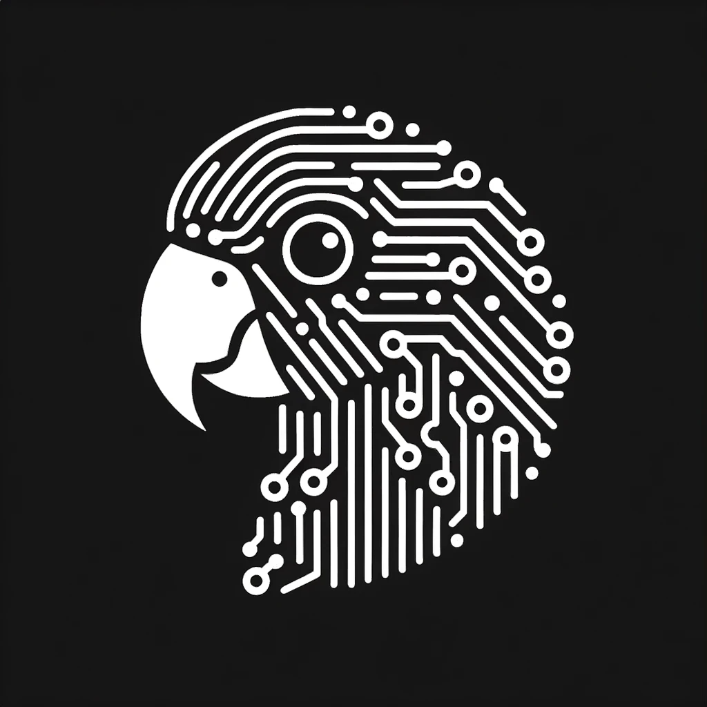

# Parakeet AI: an open-source chat UI

## Open-source next.js-based AI chat UI.

## Running the project

1. you'll need a PlanetScaleDB account, free tier should work [https://planetscale.com/](https://planetscale.com/)
2. Run the two SQL commands from `db/initialization/schema.sql` in your PlanetScaleDB Console tab to initialize the databases
3. you'll also need a Clerk account for authorization [https://clerk.com/](https://clerk.com/)
4. copy .env.example to a new file called .env and fill in the values from those two accounts plus your openai dev account
5. `npm install` to install dependencies, `npm run dev` to start dev mode, `npm run build` to build, `npm run start` to start the server after building

## TODOs / Contributing

Find issues to work on in the issues tab!
